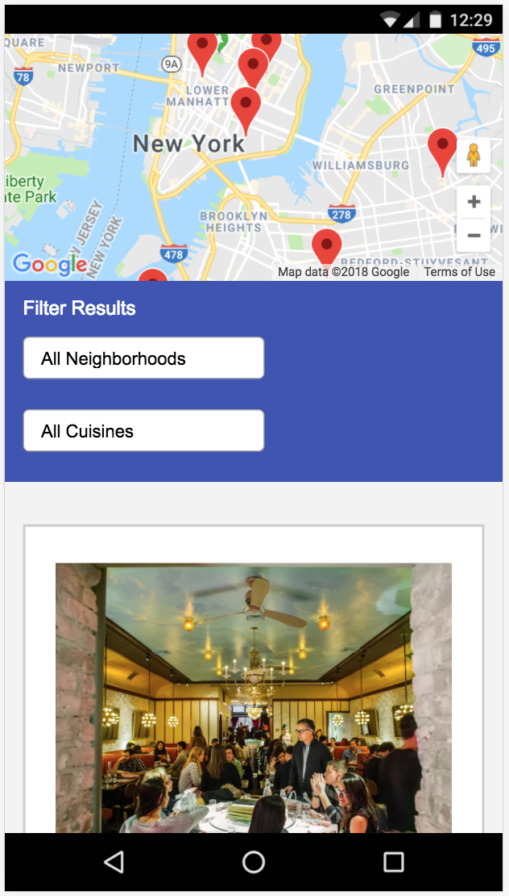
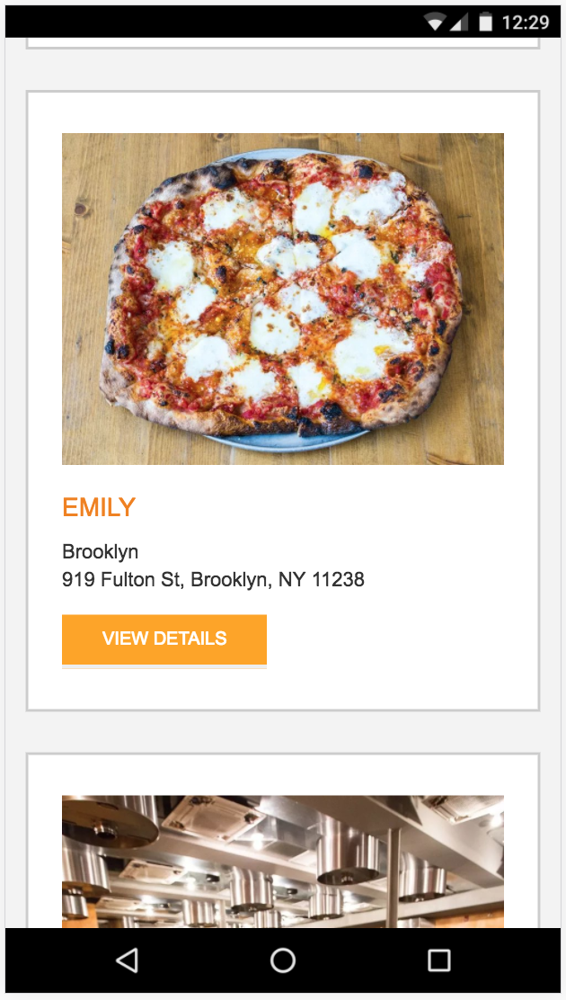
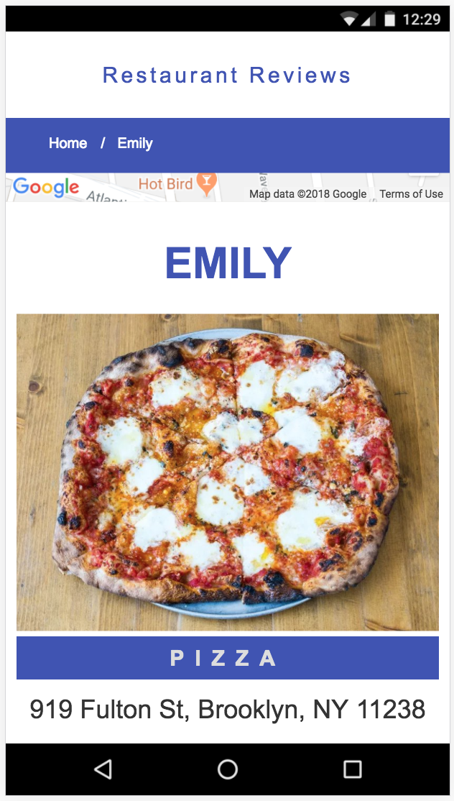
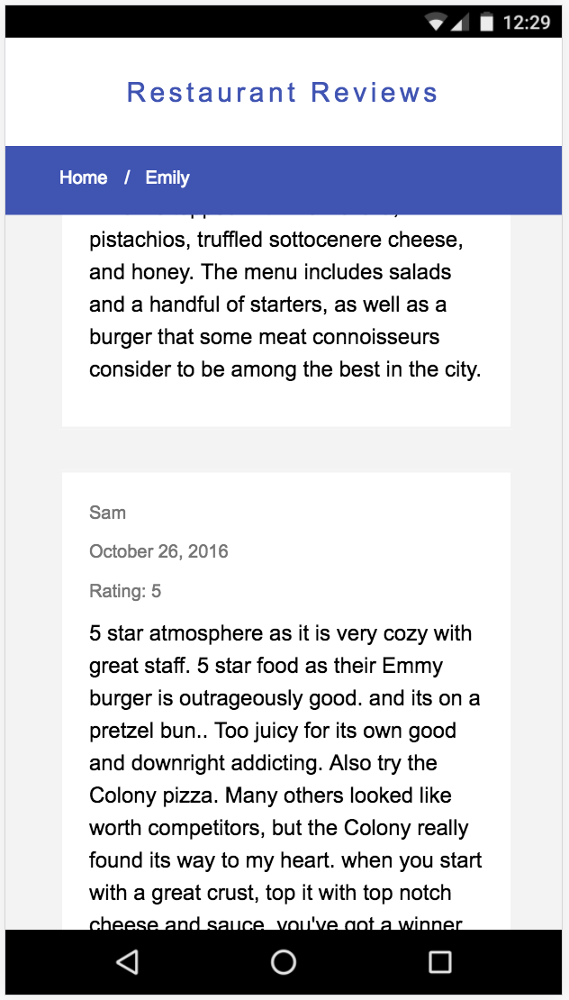

# Restaurant Reviews Progressive Web App

This repository contains all the files related to a Restaurant Reviews Progressive Web App (PWA) made during the Mobile Web Specialist Nanodegree from Udacity. It contains two main views, one that includes a list of restaurants and another one that includes the restaurant detail. It is based on the Mobile-First approach (it's completely responsive) and it works offline thanks to the service workers and the browser cache.

## Installation

In order to install the app locally, you need to follow the next steps:

```
git clone https://github.com/miquelarranz/restaurants.git
cd restaurants
yarn install
```

## Usage

To run the project, you can start it up with a simple HTTP server to serve up the site files on your local computer. Python has some simple tools to do this, and you don't even need to know Python. For most people, it's already installed on your computer.

In a terminal, check the version of Python you have: `python -V`. If you have Python 2.x, spin up the server with `python -m SimpleHTTPServer 8000` (or some other port, if port 8000 is already in use.) For Python 3.x, you can use `python3 -m http.server 8000`. If you don't have Python installed, navigate to Python's [website](https://www.python.org/) to download and install the software.

With your server running, visit the site: `http://localhost:8000`.

## License

Restaurants is distributed under the MIT license.

## Screenshots








